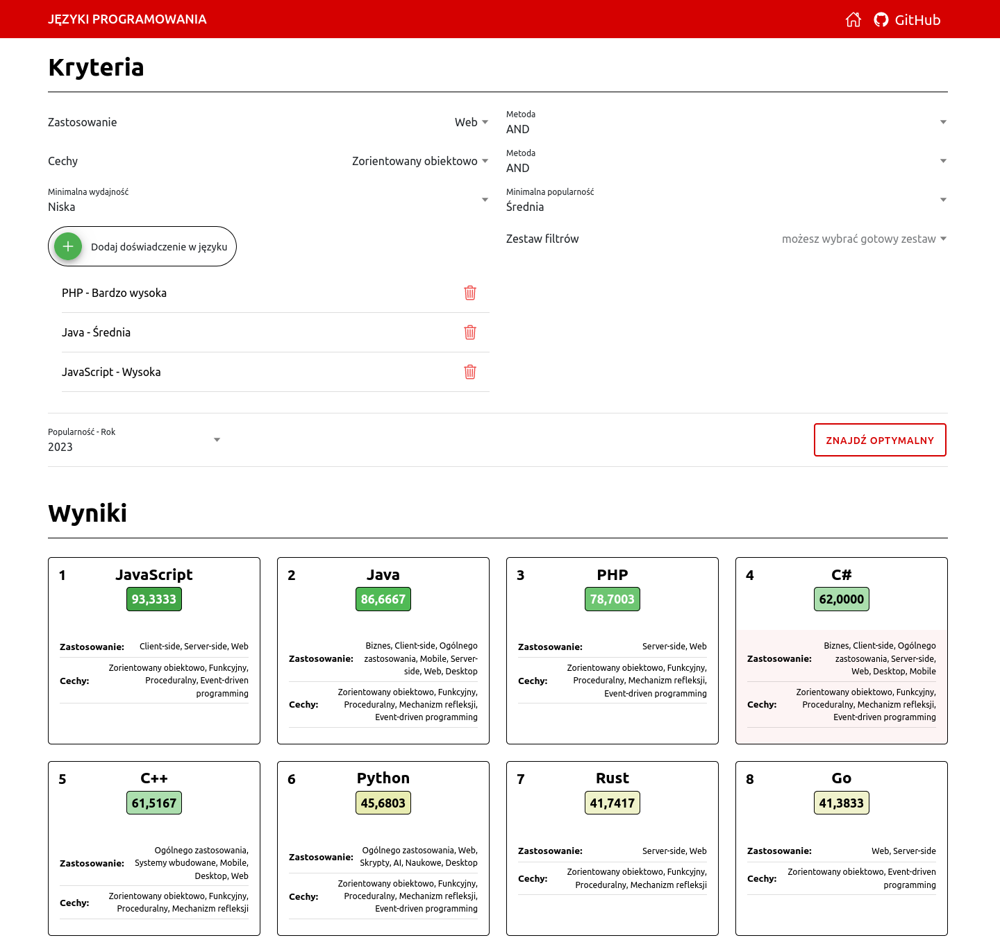

# symfony-inference-system

Inference System for Selecting the Optimal Programming Language.

## Demo Page

https://languages.mikoweb.usermd.net

## Technology stack

* PHP 8.3
* Symfony Framework 6.4
* TypeScript 5
* Angular Framework 17
* Ionic Components
* REST API
* No database!

## Criteria of choice

### Classical logic select box

There are two multi-select fields `Language Usage` and `Features` with `AND` and `OR` search methods.

These fields are used to narrow down your results.

### Fuzzy logic fields

There are three fields using fuzzy logic: `Minimum performance`, `Minimum popularity`,`Language experience` - they 
take the values `Very high`, `High`, `Medium`, `Low`, `Very low`, sometimes `None`.

Based on these values, a numerical score is calculated using a fuzzy logic mechanism.

### Popularity forecasts

There is a selectbox called `Popularity - Year` where you can select a year from the future. 
This is used to change the behavior of the `Minimum Popularity` field. By default, real data from 2023 are taken. 
However, years in the future can be selected and the data is predicted using the linear regression 
algorithm `sklearn.linear_model.BayesianRidge`. A Python command was used to generate the data - `ml` directory.

## Tests

The test kit is located in the folder `tests`.

To run the tests, run the command:

    php8.3 composer.phar run test

## Optimizations

Data is stored in read-only files in csv and json formats. Most of them were downloaded from kaggle.com. 
They are located in the `resources/dataset` folder.

This data is read and processed by the application only once and kept in memory. 
Data is also cached using the `Symfony Cache Component`. In fact, they are kept in the form of PHP serialization format.

## How to run

Go to project directory.

To run the backend, use docker:

    docker compose up --build

The backend is available at: 

    http://localhost:8741

Go to frontend directory:

    cd frontend

Set api url in the environment variable, i.e. in the file `src/environments/environment.ts`:

    apiBaseUrl: 'http://localhost:8741'    

To run the frontend, execute the following commands:

    nvm use 20
    npm install
    npm run start

The frontend is available at:

    http://localhost:4200

## Copyrights

Copyright © Rafał Mikołajun 2024.
