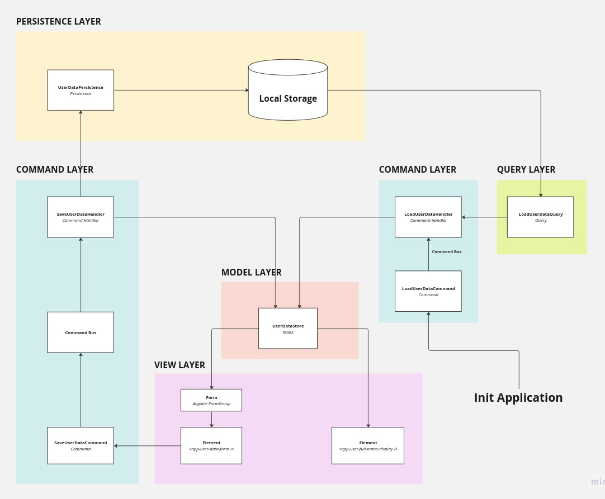

# ionic-angular-site

Site boilerplate in Ionic and Angular with MVC and CQRS using native browser Web Components.

## Architecture

### Patterns

* [Model - View (Element) - Command](https://en.wikipedia.org/wiki/Model%E2%80%93view%E2%80%93controller)
* [CQRS - Command Query Responsibility Segregation](https://martinfowler.com/bliki/CQRS.html)
* [Web Components](https://developer.mozilla.org/en-US/docs/Web/API/Web_components)
* [Custom Elements](https://developer.mozilla.org/en-US/docs/Web/API/Web_components/Using_custom_elements)
* [State management](https://mobx.js.org/README.html)
* [Dependency injection](https://angular.io/guide/dependency-injection)
* [Hexagonal directory structure](https://github.com/CodelyTV/php-ddd-example#-hexagonal-architecture)

### Frameworks and libraries

* [Angular Framework](https://angular.io/)
* [Ionic Framework](https://ionicframework.com/)
* [Material Web](https://github.com/material-components/material-web/tree/v0.27.0)
* [Command Bus](https://www.npmjs.com/package/@tshio/command-bus)
* [MobX](https://mobx.js.org/)

## Copyrights

Copyright (c) Rafał Mikołajun 2023.
